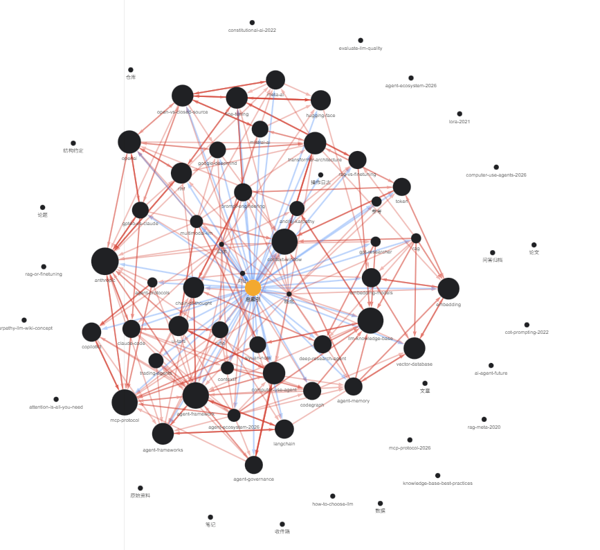
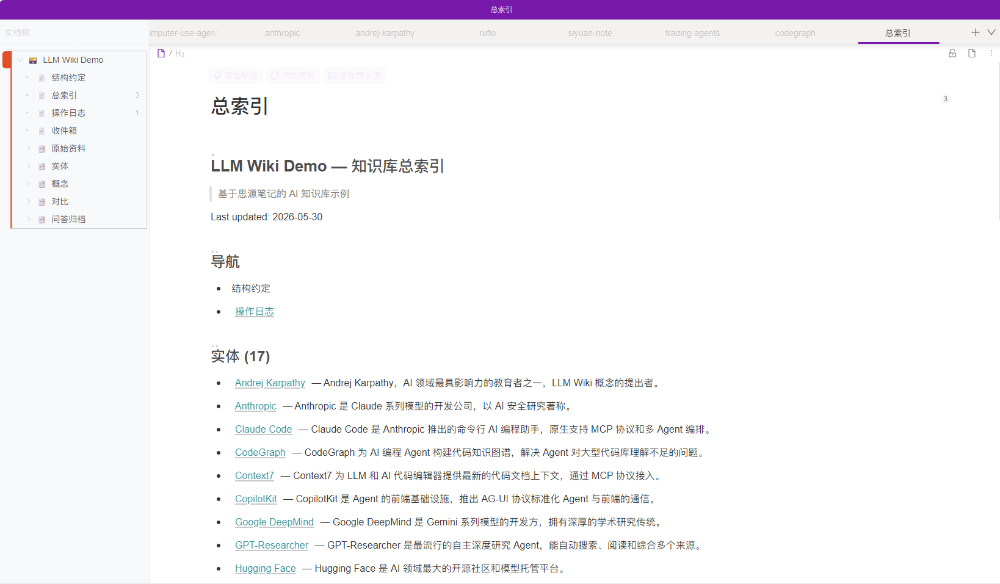

# SiYuan LLM Wiki

基于 [思源笔记](https://b3log.org/siyuan/) 的 AI 知识库构建系统。

把原始素材交给 Agent，自动编译成交叉引用、结构化的 Wiki。知识可查、可审、可增量维护。

> 灵感来自 [Andrej Karpathy 的 LLM Wiki 方案](https://gist.github.com/karpathy/442a6bf555914893e9891c11519de94f)。

## 效果预览

**知识图谱** — 1,265 条双向链接形成的网络：



**总索引** — 结构化的导航入口 + block ref 交叉引用：



## 它做什么

```
原始素材 (MD/PDF/URL)
    ↓ Agent 摄入
MCP Server ← → 思源笔记
    ↓ Agent 编译
结构化 Wiki（实体/概念/对比/问答）
    ↓ Agent 查询
带来源引用的综合回答
```

**核心分工**：

- **MCP Server**：负责稳定的读写、索引、校验原语
- **Agent**（Claude Code / Cursor / Codex）：负责编译推理、内容总结、交叉引用
- **思源笔记**：底层存储、双链引擎、多端同步

## 快速开始

### 1. 启动服务

```bash
cp .env.example .env
# 编辑 .env，设置 SIYUAN_ACCESS_AUTH_CODE 和 SIYUAN_TOKEN

docker compose up -d
```

启动后：

| 服务 | 地址 |
|------|------|
| 思源笔记 | http://localhost:6806 |
| MCP Server | http://localhost:31710/mcp |

### 2. 获取 API Token

打开思源笔记 → 设置 → 关于 → API Token，复制到 `.env` 的 `SIYUAN_TOKEN`。

### 3. 连接 Agent

在你的 AI Agent 中配置 MCP Server：

```json
{
  "mcpServers": {
    "siyuan-llmwiki": {
      "url": "http://localhost:31710/mcp"
    }
  }
}
```

### 4. 初始化知识库

告诉 Agent：

```
帮我创建一个叫 ai-research 的知识库
```

Agent 会自动调用 `wiki_bootstrap` 创建完整的 Wiki 结构。

### 5. 导入素材

把 Markdown 文件放到 `data/imports/` 目录，然后告诉 Agent：

```
把 data/imports 里的论文导入到 ai-research 知识库
```

或者直接给 Agent 一个 URL：

```
帮我把这篇文章摄入知识库：https://example.com/article
```

## 架构

```
┌─────────────────────────────────────────────────┐
│                    Agent 层                       │
│  (Claude Code / Cursor / Codex / OpenClaw)       │
│  - 编译推理（raw → wiki）                         │
│  - 查询综合（跨页面回答）                          │
│  - 健康检查（lint / audit）                       │
└─────────────┬───────────────────────────────────┘
              │ MCP Streamable HTTP
              ↓
┌─────────────────────────────────────────────────┐
│                MCP Server (Node.js)              │
│  - wiki_bootstrap    初始化知识库结构              │
│  - wiki_ingest_*     摄入原始素材                 │
│  - wiki_read_*       读取 wiki 内容               │
│  - wiki_write_*      写入 wiki 页面               │
│  - wiki_query        检索（词法 + 语义）           │
│  - wiki_lint         结构健康检查                  │
└─────────────┬───────────────────────────────────┘
              │ SiYuan HTTP API
              ↓
┌─────────────────────────────────────────────────┐
│              思源笔记 (Docker)                    │
│  - 笔记本管理                                    │
│  - 双链引擎                                      │
│  - 块级编辑                                      │
│  - 多端同步                                      │
└─────────────────────────────────────────────────┘
```

## 知识库结构

每个知识库在思源笔记中是一棵这样的树：

```
<知识库>/
├── 结构约定          ← 元信息、导航入口
├── 总索引            ← 主目录
├── 操作日志          ← 只追加的操作记录
├── 收件箱            ← 待处理资料入口
├── 原始资料/         ← 不可变，只增不改
│   ├── 文章/
│   ├── 论文/
│   ├── 仓库/
│   ├── 笔记/
│   └── 数据/
├── 实体              ← 人物、组织、产品、工具
├── 概念/             ← 主题、技术、方法论
│   ├── 参考/
│   └── 论题/
├── 对比              ← 并排分析
└── 问答归档          ← 沉淀后的结论
```

## MCP 工具一览

| 工具 | 用途 | 读/写 |
|------|------|-------|
| `wiki_bootstrap` | 初始化知识库结构 | 写 |
| `wiki_select` | 选择目标知识库 | 读 |
| `wiki_ingest_text` | 导入单条素材 | 写 |
| `wiki_ingest_batch` | 批量导入 | 写 |
| `wiki_read_tree` | 读取知识库目录树 | 读 |
| `wiki_read_page` | 读取单个页面 | 读 |
| `wiki_read_markdown_batch` | 批量读取页面 | 读 |
| `wiki_write_markdown_from_tree` | 批量写入页面 | 写 |
| `wiki_ensure_page` | 创建或覆盖页面 | 写 |
| `wiki_replace_section` | 替换页面中的一个章节 | 写 |
| `wiki_append_under_heading` | 在章节下追加内容 | 写 |
| `wiki_query` | 检索知识库 | 读 |
| `wiki_find_related` | 查找关联页面 | 读 |
| `wiki_prepare_compile_bundle` | 准备编译素材包 | 读 |
| `wiki_list_uncompiled_raw` | 列出未编译的原始素材 | 读 |
| `wiki_archive_conclusion` | 归档结论 | 写 |
| `wiki_lint` | 结构健康检查 | 读 |
| `wiki_check_index` | 索引一致性检查 | 读 |
| `wiki_compare_sources` | 对比多个页面 | 读 |
| `wiki_export_tree` | 导出子树为 Markdown | 读 |

## Agent 工作流

### Ingest（摄入）

```
用户给素材 → Agent 判断类型 → 写入原始资料 → 自动分析 → 生成/更新 wiki 页面 → 更新索引
```

### Query（查询）

```
用户提问 → Agent 读总索引 → 读相关页面 → 跨页面综合 → 带来源引用的回答
```

### Lint（自检）

```
Agent 读结构 → 检查缺页/孤立页/缺失引用 → 检查原始素材覆盖 → 报告问题
```

## 示例

本仓库包含一组 LLM/AI 领域的样例 wiki 页面，展示系统能力：

- `examples/raw/` — 原始素材（模拟摄入的论文和文章）
- `examples/wiki/` — 编译后的 wiki 页面（实体、概念、对比、问答）

查看 [examples/README.md](examples/README.md) 了解详情。

在线演示：[GitHub Pages](https://wddxg.github.io/siyuan-llmwiki/)

## 部署方式

### Docker（推荐）

```bash
docker compose up -d
```

### 本地开发

```bash
# 1. 安装并启动思源笔记
# 2. 启动 MCP Server
cd mcp
npm install
SIYUAN_URL=http://127.0.0.1:6806 SIYUAN_TOKEN=your-token npm start
```

### macOS / Windows

思源笔记支持 macOS 和 Windows 原生运行。只需：

1. 安装 [思源笔记](https://b3log.org/siyuan/download.html)
2. 获取 API Token
3. 运行 MCP Server（Node.js >= 18）

## 文档

- [快速开始](docs/zh-CN/quick-start.md)
- [Agent 配置指南](docs/zh-CN/agent-setup.md)
- [MCP 工具详解](docs/zh-CN/mcp-tools.md)
- [Wiki 概念说明](docs/zh-CN/wiki-concepts.md)

## Skills

本仓库提供两个 Agent Skill 文件，可直接安装到支持 Skill 的 Agent 平台：

- `skills/siyuan-skill.SKILL.md` — 思源笔记 CLI 技能（来自 [dazexcl/siyuan-skill](https://github.com/dazexcl/siyuan-skill)）
- `skills/llm-wiki-skill.SKILL.md` — LLM Wiki 编排技能（本项目自定义）

## 工具脚本

```bash
# 准备本地 Markdown 为批量导入 JSON
python tools/prepare_raw_batch.py --input ./papers/ --output batch.json

# 准备导入包（支持目录树和扁平导入）
python tools/prepare_import_bundle.py --path ./my-wiki/ --output bundle.json

# 思源笔记管理 CLI
python tools/siyuan_admin.py --base http://localhost:6806 --token xxx list-notebooks
```

## 许可证

[MIT](LICENSE)
